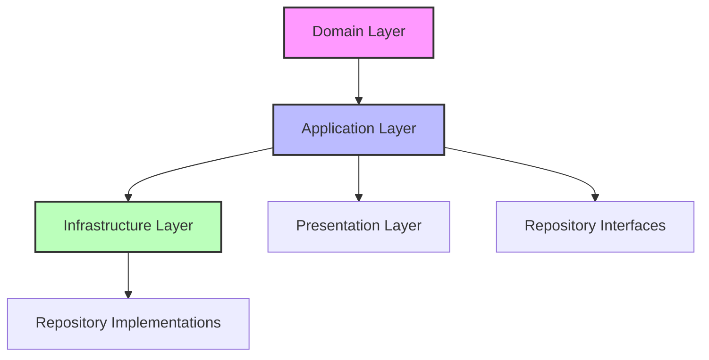

# 🚀 Generic Repository Pattern with Unit of Work

[](https://dotnet.microsoft.com/)
[](https://docs.microsoft.com/en-us/ef/core/)
[](https://docs.microsoft.com/en-us/dotnet/csharp/)
[](LICENSE)

A clean architecture implementation of Repository Pattern with Unit of Work and Specification Pattern support for .NET applications.

## ✨ Features

- 🎯 **Generic Repository Pattern** - Type-safe, reusable data access layer
- 💼 **Unit of Work** - Transaction management and repository coordination
- 🔍 **Specification Pattern** - Encapsulate and reuse complex queries
- 📖 **Read/Write Separation** - Following CQRS principles
- ⚡ **High Performance** - Optimized for Entity Framework Core
- 🔄 **Full Async Support** - All operations support async/await with CancellationToken
- 🔗 **Fluent API** - Chain operations for better readability

## 📁 Project Structure

```
🏗️ Repository Pattern Architecture
│
├── 📦 Core Layer
│   └── 🔷 Application
│       └── 📁 Interfaces
│           ├── 🔹 IRepository<T>
│           ├── 🔹 IReadRepository<T>  
│           ├── 🔹 IWriteRepository<T>
│           ├── 🔹 IUnitOfWork
│           └── 🔹 ISpecification<T>
│
└── 📦 Infrastructure Layer
    └── 🔶 Persistence
        ├── 📁 Repositories
        │   ├── 📄 ReadRepository<T>
        │   ├── 📄 WriteRepository<T>
        │   ├── 📄 SpecificationRepository<T>
        │   └── 📄 UnitOfWork
        └── 📁 Specifications
            └── 📄 SpecificationEvaluator<T>
```

## 🎯 Architecture Overview

<details>
<summary><b>Clean Architecture Layers</b></summary>


</details>

## 🔧 Installation

### 1. Add to your project
```bash
dotnet add package YourPackageName
```

### 2. Register services
```csharp
// Program.cs or Startup.cs
builder.Services.AddPersistenceServices(builder.Configuration);
```

### 3. Configure your DbContext
```csharp
services.AddDbContext<ApplicationDbContext>(options =>
    options.UseSqlServer(configuration.GetConnectionString("DefaultConnection")));
```

## 💻 Usage Examples

### 📖 Basic Read Operations

```csharp
public class ProductService
{
    private readonly IUnitOfWork _unitOfWork;
    
    public async Task<Product?> GetProductAsync(Guid id)
    {
        return await _unitOfWork
            .GetReadRepository<Product>()
            .AsNoTracking()
            .GetByIdAsync(id);
    }
}
```

### ✍️ Write Operations

```csharp
public async Task CreateProductAsync(Product product)
{
    var writeRepo = _unitOfWork.GetWriteRepository<Product>();
    await writeRepo.AddAsync(product);
    await _unitOfWork.SaveChangesAsync();
}
```

### 🔍 Using Specifications

```csharp
// Define specification
public class ActiveProductsSpec : BaseSpecification<Product>
{
    public ActiveProductsSpec(decimal minPrice) 
        : base(p => p.IsActive && p.Price >= minPrice)
    {
        AddInclude(p => p.Category);
        ApplyOrderByDescending(p => p.CreatedDate);
    }
}

// Use specification
var spec = new ActiveProductsSpec(minPrice: 100);
var products = await _unitOfWork
    .GetSpecificationRepository<Product>()
    .FindAsync(spec);
```

### 💼 Transaction Management

```csharp
public async Task TransferProductsAsync(Guid fromCategoryId, Guid toCategoryId)
{
    await _unitOfWork.BeginTransactionAsync();
    
    try
    {
        var products = await GetProductsByCategoryAsync(fromCategoryId);
        foreach (var product in products)
        {
            product.CategoryId = toCategoryId;
        }
        
        await _unitOfWork.SaveChangesAsync();
        await _unitOfWork.CommitTransactionAsync();
    }
    catch
    {
        await _unitOfWork.RollbackTransactionAsync();
        throw;
    }
}
```

## 🏗️ Patterns & Principles

| Pattern | Description |
|---------|-------------|
| **Repository Pattern** | Encapsulates data access logic and provides a more object-oriented view of the persistence layer |
| **Unit of Work** | Maintains a list of objects affected by a business transaction and coordinates writing out changes |
| **Specification Pattern** | Encapsulates query logic in reusable classes |
| **SOLID Principles** | Single Responsibility, Open/Closed, Liskov Substitution, Interface Segregation, Dependency Inversion |

## 📋 API Reference

<details>
<summary><b>IReadRepository</b></summary>

```csharp
public interface IReadRepository<T> : IRepository<T> where T : BaseEntity
{
    Task<T?> GetByIdAsync(Guid id, CancellationToken cancellationToken = default);
    Task<IEnumerable<T>> GetAllAsync(CancellationToken cancellationToken = default);
    Task<T?> FirstOrDefaultAsync(Expression<Func<T, bool>> predicate, CancellationToken cancellationToken = default);
    Task<IEnumerable<T>> FindAsync(Expression<Func<T, bool>> predicate, CancellationToken cancellationToken = default);
    Task<bool> AnyAsync(Expression<Func<T, bool>> predicate, CancellationToken cancellationToken = default);
    Task<int> CountAsync(Expression<Func<T, bool>>? predicate = null, CancellationToken cancellationToken = default);
    IReadRepository<T> AsNoTracking();
    IReadRepository<T> AsTracking();
}
```
</details>

<details>
<summary><b>IWriteRepository</b></summary>

```csharp
public interface IWriteRepository<T> where T : BaseEntity
{
    Task<T> AddAsync(T entity, CancellationToken cancellationToken = default);
    Task AddRangeAsync(IEnumerable<T> entities, CancellationToken cancellationToken = default);
    void Update(T entity);
    void UpdateRange(IEnumerable<T> entities);
    void Remove(T entity);
    void RemoveRange(IEnumerable<T> entities);
    Task RemoveByIdAsync(Guid id, CancellationToken cancellationToken = default);
}
```
</details>

## 🤝 Contributing

Contributions are welcome! Please feel free to submit a Pull Request.

1. Fork the repository
2. Create your feature branch (`git checkout -b feature/AmazingFeature`)
3. Commit your changes (`git commit -m 'Add some AmazingFeature'`)
4. Push to the branch (`git push origin feature/AmazingFeature`)
5. Open a Pull Request

## 📄 License

This project is licensed under the MIT License - see the [LICENSE](LICENSE) file for details.

## 🙏 Acknowledgments

- Inspired by Clean Architecture principles by Robert C. Martin
- Built with Entity Framework Core
- Following Microsoft's .NET design guidelines

---

<p align="center">
Made with ❤️ by BerkGrbzSoftEng
</p>
